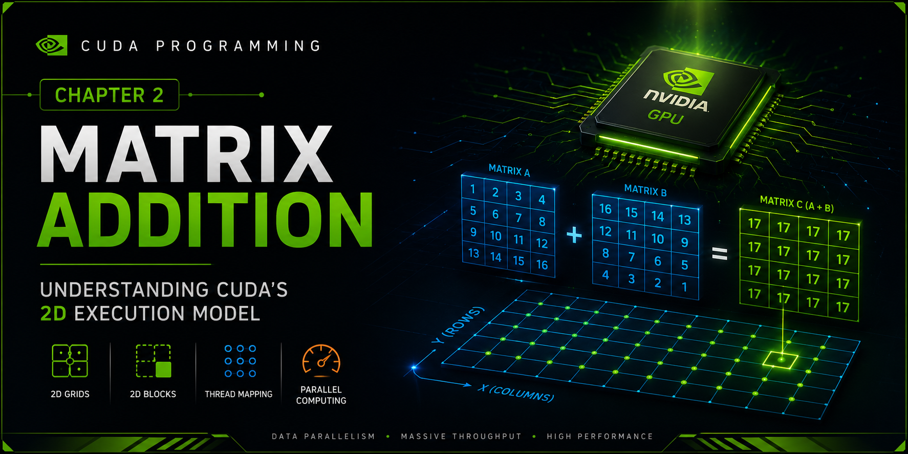
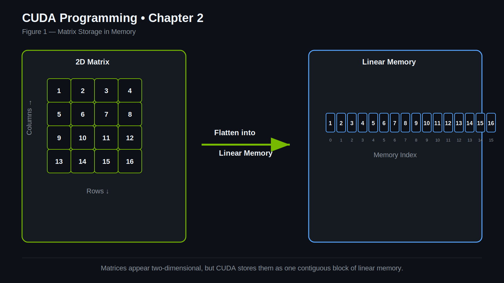
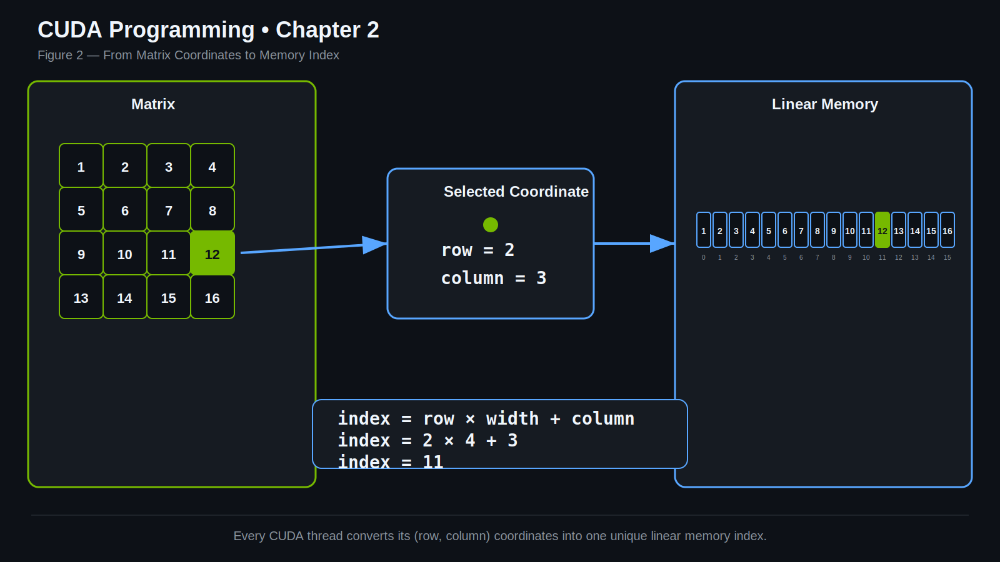
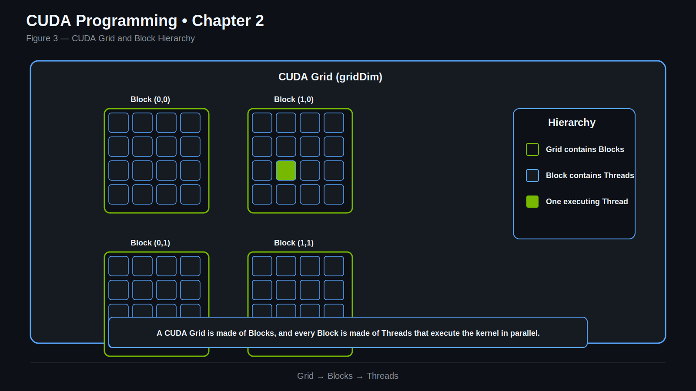
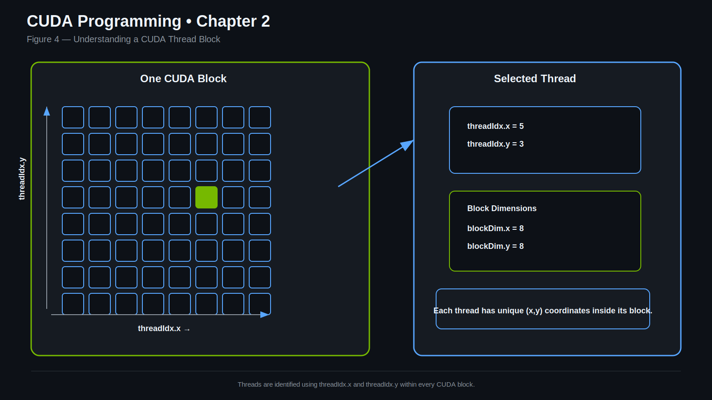
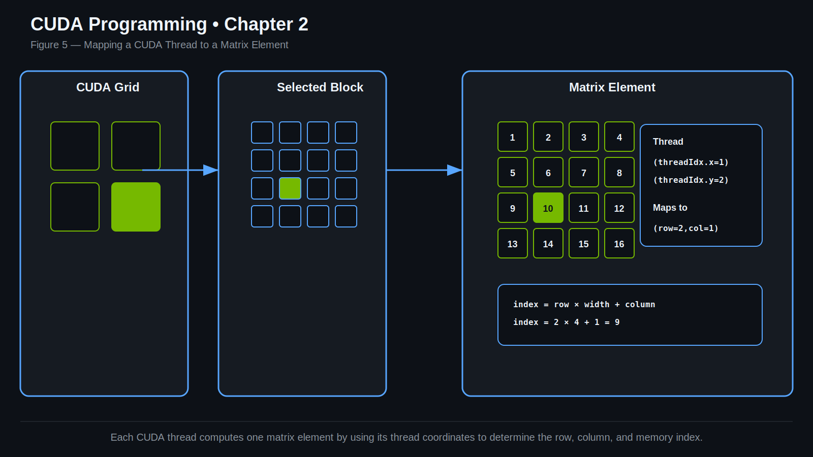
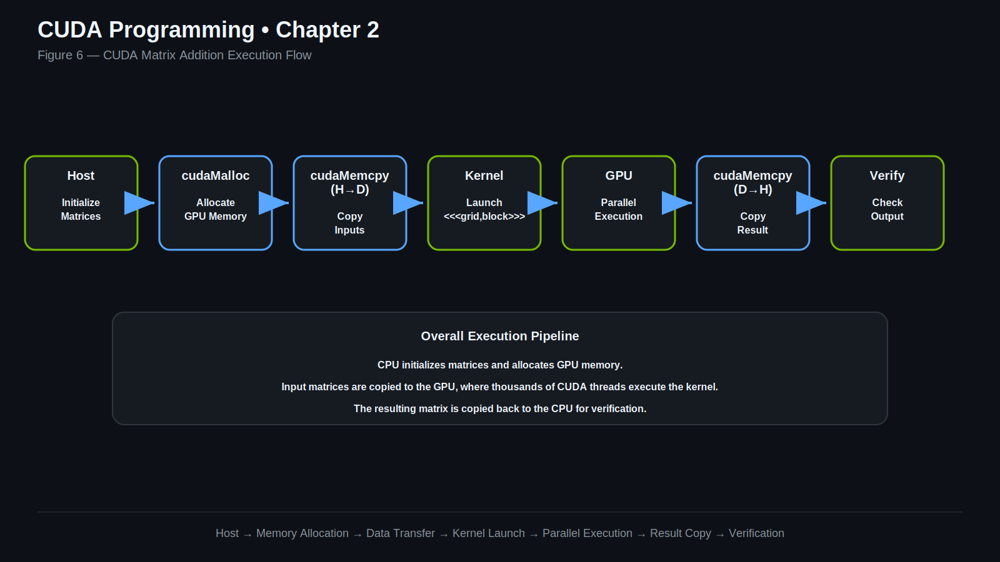
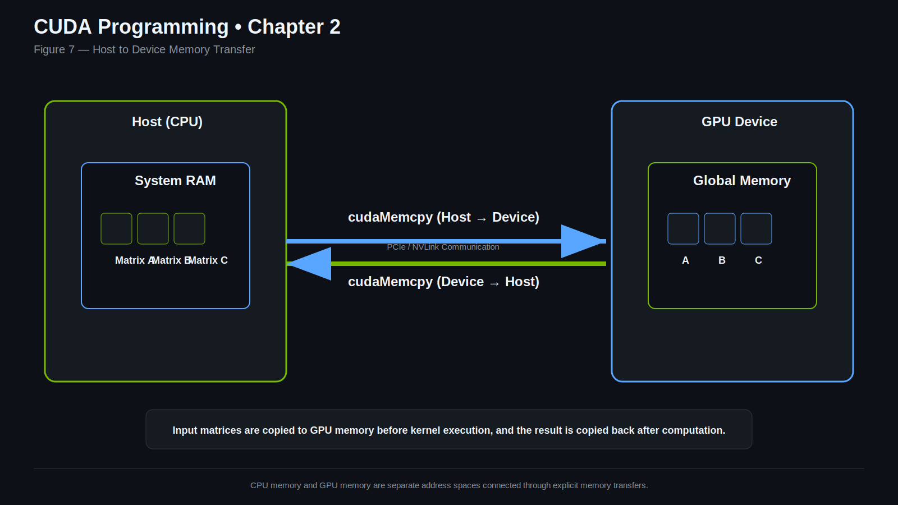
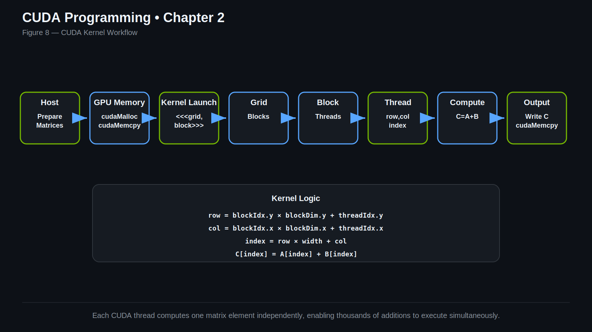

# Matrix Addition using CUDA

> Learn how CUDA uses **2D grids**, **2D thread blocks**, and **parallel execution** to perform matrix addition on the GPU.

---

<p align="center">
    
</p>

---

> [!NOTE]
>
> **Chapter 2 of the CUDA Programming Series**
>
> In **Chapter 1**, we explored how CUDA performs Vector Addition using one-dimensional thread indexing.
>
> In this chapter, we'll extend that knowledge to **two-dimensional parallelism**, allowing GPU threads to process matrices efficiently.
>
> This is one of the most important milestones in learning CUDA programming.

---

> [!TIP]
>
> **Why is this chapter important?**
>
> The concepts introduced here form the foundation for:
>
> - 🖼 Image Processing
> - 🤖 Deep Learning
> - 🧠 Computer Vision
> - 🔬 Scientific Computing
> - ⚡ Matrix Multiplication
> - 📊 Numerical Simulations

---

#  Introduction

After understanding how CUDA executes a simple **Vector Addition** kernel, the next logical step is working with **two-dimensional data**.

Unlike vectors, matrices contain both **rows** and **columns**, making them an excellent example for learning CUDA's two-dimensional execution model.

In this project, each GPU thread is responsible for computing exactly **one element** of the output matrix.

Instead of using a single thread index as we did for vectors, CUDA combines **thread indices** and **block indices** across both the **x** and **y** dimensions to uniquely identify every matrix element.

Although Matrix Addition is mathematically simple, it introduces several fundamental CUDA concepts:

- Working with **2D thread blocks**
- Launching **2D grids**
- Mapping threads to matrix coordinates
- Converting 2D coordinates into linear memory
- Boundary checking
- Parallel execution over two-dimensional data

These ideas are reused throughout modern GPU programming.

Whether you're implementing Matrix Multiplication, Convolution, Image Processing, or Deep Learning kernels, the execution model remains remarkably similar.

By the end of this chapter, you'll understand not only how Matrix Addition works, but also how CUDA organizes thousands of GPU threads to efficiently process two-dimensional data.

---

#  Chapter Overview

In this chapter you'll learn:

- 📐 How matrices are stored in memory
- 🧩 Why CUDA uses 2D grids and 2D blocks
- 🧵 How GPU threads map to matrix elements
- 🔢 How to convert 2D coordinates into linear memory indices
- ⚙️ How a complete CUDA Matrix Addition program executes
- 📊 Why this execution model scales efficiently to large matrices

By the end of this chapter, you'll have the foundation required for more advanced CUDA topics such as Matrix Multiplication and Shared Memory.

---

#  Learning Objectives

After completing this chapter, you will understand:

-  Matrix representation in memory
-  CUDA's 2D execution hierarchy
-  Configuring `dim3`
-  Computing global thread coordinates
-  Mapping 2D coordinates into linear memory
-  Boundary checking
-  Host ↔ Device memory transfers
-  Complete CUDA execution flow

---

#  Prerequisites

Before starting this chapter, you should already understand:

- CUDA Kernels
- Thread Hierarchy
- Host vs Device Memory
- cudaMalloc()
- cudaMemcpy()
- Kernel Launch Syntax
- cudaDeviceSynchronize()

If you're new to CUDA, complete **Chapter 1 – Vector Addition** first.

---

#  Why Matrix Addition?

At first glance, Matrix Addition appears to be a straightforward extension of Vector Addition.

However, from CUDA's perspective, it introduces an entirely new execution model.

Vectors require only one-dimensional indexing.

Matrices require two-dimensional indexing.

Instead of asking:

> Which vector element should this thread process?

we now ask:

> Which row and which column should this thread process?

Answering this question introduces CUDA's **2D Grid** and **2D Block** hierarchy.

Although the mathematical operation is simple,

```text
C(row, column) = A(row, column) + B(row, column)
```

the execution model is identical to that used in many real-world GPU applications.

Every GPU thread performs the computation for one matrix element, while thousands of other threads execute independently.

This concept lies at the heart of GPU programming.

# How Matrices are Stored in Memory

When we write a matrix on paper, it naturally appears as a **two-dimensional structure** consisting of rows and columns.

For example, consider the following **4 × 4** matrix.

<p align="center">
    
</p>

<p align="center">
<i><b>Figure 1.</b> Although matrices appear two-dimensional, they are stored as one continuous block of memory.</i>
</p>

At first glance, the matrix appears to occupy a two-dimensional space.

However, computers do **not** store matrices as rows and columns in memory.

Instead, every element is placed one after another inside a **single contiguous block of memory**.

For the matrix shown above, the memory layout becomes:

```text
1 2 3 4 5 6 7 8 9 10 11 12 13 14 15 16
```

Even though programmers think in terms of **rows** and **columns**, CUDA always works with **linear memory**.

This is why matrices are commonly allocated as one-dimensional arrays:

```cpp
int* A = new int[N * N];
```

instead of

```cpp
int A[N][N];
```

Both representations ultimately occupy contiguous memory, but using a flat array makes memory allocation and transfers between the CPU and GPU much simpler.

---

# 📐 From Matrix Coordinates to Memory Addresses

Since CUDA stores matrices as linear arrays, every matrix element must be converted from a **2D coordinate** into a **1D memory index**.

Suppose we want to access the element located at:

```text
Row    = 2

Column = 3
```

CUDA computes its position in memory using the following equation:

```cpp
index = row * width + column;
```

where:

- `row` is the row number
- `column` is the column number
- `width` is the total number of columns in the matrix

This simple equation is one of the most frequently used formulas in GPU programming.

---

#  Understanding the Formula

Consider a **4 × 4** matrix.

<p align="center">
    
</p>

<p align="center">
<i><b>Figure 2.</b> Every matrix element is identified by its row and column, then converted into a linear memory index.</i>
</p>

Suppose we want to access the element located at:

```text
(row = 2, column = 3)
```

Before reaching **row 2**, memory must first skip all elements contained in the previous rows.

Since each row contains **4 elements**, CUDA skips:

```text
2 × 4 = 8 elements
```

After reaching the correct row, it simply moves to the desired column.

```text
8 + 3 = 11
```

Therefore,

```text
index = row × width + column

index = 2 × 4 + 3

index = 11
```

Notice that the computed value is **not** the matrix element itself.

It is the position of that element inside linear memory.

---

#  Applying It to Our CUDA Kernel

Inside the kernel, every thread computes its own memory index.

```cpp
int index = i * size + j;
```

Here:

- `i` represents one matrix coordinate.
- `j` represents the other matrix coordinate.
- `size` represents the width of the matrix.

Once the thread knows its memory location, it simply performs:

```cpp
C[index] = A[index] + B[index];
```

Each GPU thread therefore operates on exactly **one matrix element**.

---

#  Why Does CUDA Use Linear Memory?

GPUs are designed to process enormous amounts of data efficiently.

Keeping matrix elements inside one continuous memory block provides several advantages:

- Faster memory allocation
- Efficient memory transfers between CPU and GPU
- Better cache utilization
- Coalesced global memory accesses
- Improved scalability for very large matrices

Nearly every CUDA application—including matrix multiplication, image processing, convolution, and deep learning—stores multidimensional data using this same linear memory layout.

---

> 💡 **Key Takeaway**
>
> Although matrices appear two-dimensional, CUDA stores them as a **one-dimensional contiguous array**.
>
> Every GPU thread converts its **(row, column)** coordinates into a linear memory index using:
>
> ```text
> index = row × width + column
> ```
>
> This mapping allows thousands of GPU threads to efficiently access different matrix elements in parallel.

#  Understanding CUDA's 2D Execution Model

In **Chapter 1**, we learned that each GPU thread was responsible for processing one element of a vector.

For vectors, a single thread index was enough because vectors contain only one dimension.

```text
Vector

0   1   2   3   4   5

 ↑   ↑   ↑   ↑   ↑   ↑

T0  T1  T2  T3  T4  T5
```

Matrices are different.

A matrix has both **rows** and **columns**, so CUDA must organize threads in two dimensions.

To achieve this, CUDA introduces a hierarchy consisting of:

- Grid
- Blocks
- Threads

Each level has a specific responsibility.

Understanding this hierarchy is essential for writing efficient CUDA programs.

---

#  CUDA Execution Hierarchy

The relationship between Grids, Blocks, and Threads can be visualized below.

<p align="center">
    
</p>

<p align="center">
<i><b>Figure 3.</b> CUDA organizes GPU threads into blocks, and blocks into a grid.</i>
</p>

When a CUDA kernel is launched:

- CUDA creates one **Grid**
- The Grid contains multiple **Blocks**
- Each Block contains many **Threads**

Every thread executes exactly the same kernel function.

The only difference between threads is their unique position inside the execution hierarchy.

---

# Understanding 2D Thread Blocks

A thread block is simply a collection of GPU threads.

Unlike Vector Addition, where threads were arranged in a straight line, Matrix Addition organizes threads into **rows and columns**.

For example,

```cpp
dim3 blockDim(32,16);
```

creates a block containing:

- 32 threads along the x-axis
- 16 threads along the y-axis

for a total of

```text
32 × 16 = 512 threads
```

The internal layout of a thread block is illustrated below.

<p align="center">
    
</p>

<p align="center">
<i><b>Figure 4.</b> A two-dimensional thread block where every thread has a unique (x, y) coordinate.</i>
</p>

Every thread inside the block can determine its local position using:

```cpp
threadIdx.x
threadIdx.y
```

These coordinates are always relative to the current block.

---

#  Understanding the Grid

A single thread block is usually not large enough to process an entire matrix.

CUDA therefore groups multiple blocks into a larger structure called a **Grid**.

For example,

```cpp
dim3 gridDim(
    (N + blockDim.x - 1) / blockDim.x,
    (N + blockDim.y - 1) / blockDim.y
);
```

creates enough blocks to cover the entire matrix.

Every block has its own position inside the Grid.

CUDA provides these coordinates through:

```cpp
blockIdx.x
blockIdx.y
```

Together,

- `blockIdx`
- `threadIdx`

allow every thread to uniquely identify its assigned matrix element.

---

#  Computing Global Thread Coordinates

Each thread knows two things:

- Its position **inside the block**
- The position of its **block inside the grid**

CUDA combines both pieces of information to compute the thread's global coordinates.

Our kernel uses:

```cpp
int i = blockIdx.x * blockDim.x + threadIdx.x;
int j = blockIdx.y * blockDim.y + threadIdx.y;
```

Conceptually, this can be understood as:

```text
column = blockIdx.x × blockDim.x + threadIdx.x

row    = blockIdx.y × blockDim.y + threadIdx.y
```

The mapping process is illustrated below.

<p align="center">
    
</p>

<p align="center">
<i><b>Figure 5.</b> CUDA combines block coordinates and thread coordinates to compute a unique global position for every thread.</i>
</p>

---

#  Mapping Threads to Matrix Elements

Once the thread computes its global row and column, it knows exactly which matrix element it should process.

For example,

```text
Thread Coordinates

Row = 2

Column = 3
```

The thread is responsible for computing:

```text
C(2,3)
```

No other thread writes to this location.

Likewise,

another thread might compute:

```text
C(0,1)
```

while another computes

```text
C(7,5)
```

Every thread works independently.

This independence allows thousands of GPU threads to execute simultaneously.

---

# ⚠ Why Boundary Checking is Necessary

Our kernel contains the following condition:

```cpp
if(i < size && j < size)
```

This check prevents threads from accessing memory outside the matrix.

For example,

suppose we have a

```text
10 × 10 matrix
```

but our thread block contains

```text
32 × 16 = 512 threads
```

CUDA still launches the complete thread block.

Many of those threads correspond to positions that do not exist in the matrix.

Without the boundary check, those threads would attempt to access invalid memory.

The boundary check simply tells these extra threads to exit without performing any computation.

---

#  Why This Hierarchy Matters

The same execution hierarchy introduced here is reused throughout CUDA programming.

You'll encounter this exact model in:

- Matrix Multiplication
- Shared Memory
- Image Processing
- Convolution
- Deep Learning Kernels
- Scientific Computing

Once you understand how CUDA maps threads to two-dimensional data, you'll be able to understand much more advanced GPU algorithms.

---

> 💡 **Key Takeaway**
>
> CUDA processes matrices using a hierarchy of **Grids**, **Blocks**, and **Threads**.
>
> Every thread computes its global row and column coordinates before determining which matrix element it should process.
>
> This execution model allows thousands of GPU threads to work independently, making CUDA highly efficient for large-scale parallel computations.

# 💻 Code Walkthrough

Now that we've understood how CUDA organizes threads to process a matrix, let's walk through the implementation step by step.

Instead of reading the entire program at once, we'll divide it into logical stages.

Every CUDA program follows approximately the same workflow.

<p align="center">
    
</p>

<p align="center">
<i><b>Figure 6.</b> High-level execution flow of a CUDA Matrix Addition program.</i>
</p>

The execution consists of the following stages:

1. Allocate memory on the CPU (Host)
2. Initialize the input matrices
3. Allocate memory on the GPU (Device)
4. Copy data from the CPU to the GPU
5. Configure the Grid and Block dimensions
6. Launch the CUDA kernel
7. Wait for the GPU to finish
8. Copy the result back to the CPU
9. Verify the output
10. Release allocated memory

Let's understand each stage individually.

---

# Step 1 — Defining the Matrix Size

The first line defines the dimensions of the matrix.

```cpp
const int N = 10;
```

Since the matrix contains:

```text
N rows

×

N columns
```

the total number of elements becomes

```text
N × N
```

For our example,

```text
10 × 10 = 100 elements
```

---

# Step 2 — Calculating Memory Requirements

Next, we calculate the total memory required.

```cpp
int matrix_size_bytes = N * N * sizeof(int);
```

CUDA memory allocation functions require the memory size in **bytes**.

Since every integer occupies

```text
4 bytes
```

our matrix requires

```text
100 × 4 = 400 bytes
```

This value will later be reused for:

- cudaMalloc()
- cudaMemcpy()

---

# Step 3 — Allocating Host Memory

Now we allocate memory on the CPU.

```cpp
int *h_a = new int[N * N];
int *h_b = new int[N * N];
int *h_c = new int[N * N];
```

The prefix

```text
h
```

stands for

```text
Host
```

These arrays store:

- Matrix A
- Matrix B
- Output Matrix C

At this stage, nothing has been allocated on the GPU.

---

# Step 4 — Initializing the Matrices

Before launching the kernel, we initialize the input data.

```cpp
for(int i = 0; i < N * N; ++i)
{
    h_a[i] = 1;
    h_b[i] = 2;
    h_c[i] = 0;
}
```

For simplicity,

every element of Matrix A is assigned

```text
1
```

every element of Matrix B is assigned

```text
2
```

and Matrix C is initialized to

```text
0
```

The expected output therefore becomes

```text
1 + 2 = 3
```

for every matrix element.

Using predictable input values makes it easy to verify the correctness of the kernel.

---

# Step 5 — Allocating Device Memory

Next, we allocate memory on the GPU.

```cpp
int *d_a;
int *d_b;
int *d_c;
```

These pointers refer to memory located on the GPU.

Memory is allocated using:

```cpp
cudaMalloc((void**)&d_a, matrix_size_bytes);
cudaMalloc((void**)&d_b, matrix_size_bytes);
cudaMalloc((void**)&d_c, matrix_size_bytes);
```

The prefix

```text
d
```

stands for

```text
Device
```

After this step,

the GPU has enough memory to store all three matrices.

---

# Step 6 — Copying Data to the GPU

The GPU cannot directly access variables stored in CPU memory.

Before computation begins, the input matrices must be copied from the Host to the Device.

<p align="center">
    
</p>

<p align="center">
<i><b>Figure 7.</b> Data is transferred from CPU memory to GPU memory before kernel execution and copied back after computation.</i>
</p>

This is performed using:

```cpp
cudaMemcpy(
    d_a,
    h_a,
    matrix_size_bytes,
    cudaMemcpyHostToDevice
);

cudaMemcpy(
    d_b,
    h_b,
    matrix_size_bytes,
    cudaMemcpyHostToDevice
);
```

The direction

```text
cudaMemcpyHostToDevice
```

means

```text
CPU → GPU
```

After these copies complete,

the GPU has everything it needs to begin computation.

---

# Step 7 — Configuring the Execution Layout

Unlike Vector Addition,

Matrix Addition uses **two-dimensional execution**.

```cpp
dim3 blockDim(32,16);

dim3 gridDim(
    (N + blockDim.x - 1) / blockDim.x,
    (N + blockDim.y - 1) / blockDim.y
);
```

Here,

we create:

- a 2D Thread Block
- a 2D Grid

Each block contains

```text
32 × 16 = 512 threads
```

The Grid dimensions are computed using **ceiling division**, ensuring that every matrix element is assigned at least one thread—even when the matrix dimensions are not perfectly divisible by the block size.

---

> 💡 **Key Takeaway**
>
> Before a CUDA kernel can execute, we must:
>
> - Allocate memory on the CPU and GPU.
> - Initialize the input data.
> - Transfer the data from the CPU to the GPU.
> - Configure an appropriate Grid and Block layout.
>
> Once these steps are complete, the GPU is ready to execute the kernel.

#  Kernel Execution

Everything we've learned so far leads to this moment.

Once the CPU has prepared the data and copied it to the GPU, CUDA launches the kernel.

Every GPU thread begins executing the same kernel function simultaneously.

```cpp
__global__ void MatrixAddition(int *A, int *B, int *C, int size)
{
    int i = blockIdx.x * blockDim.x + threadIdx.x;
    int j = blockIdx.y * blockDim.y + threadIdx.y;

    if(i < size && j < size)
    {
        int index = i * size + j;
        C[index] = A[index] + B[index];
    }
}
```

Although thousands of threads execute this function at the same time, each thread works independently on a different matrix element.

Let's follow the journey of a single GPU thread.

---

# Step 1 — Computing Global Coordinates

The first task of every thread is to determine **which matrix element it is responsible for**.

This is done using:

```cpp
int i = blockIdx.x * blockDim.x + threadIdx.x;
int j = blockIdx.y * blockDim.y + threadIdx.y;
```

Each thread already knows:

- Its local position inside the block (`threadIdx`)
- The position of its block inside the grid (`blockIdx`)

Combining these values produces the thread's unique global coordinates.

<p align="center">
    
</p>

<p align="center">
<i><b>Figure 8.</b> Every thread combines its block position and local thread position to compute its unique global coordinates.</i>
</p>

Conceptually, these coordinates represent:

```text
Row

Column
```

which identify one element inside the matrix.

---

# Step 2 — Checking Matrix Boundaries

Not every launched thread corresponds to a valid matrix element.

Before accessing memory, every thread verifies that its coordinates are inside the matrix.

```cpp
if(i < size && j < size)
```

This check is extremely important.

Suppose our matrix has dimensions:

```text
10 × 10
```

but the Grid launches more threads than required.

Threads outside the valid range simply skip the remaining code.

Without this condition, those threads would attempt to access memory beyond the allocated matrix, resulting in undefined behaviour.

---

# Step 3 — Converting Coordinates into a Memory Index

Once the thread confirms that its coordinates are valid, it converts them into a linear memory index.

```cpp
int index = i * size + j;
```

CUDA stores matrices as one-dimensional arrays.

Therefore, every thread must translate its two-dimensional coordinates into a one-dimensional memory location.

<p align="center">
    
</p>

<p align="center">
<i><b>Figure 9.</b> Matrix coordinates are converted into a linear memory index before accessing GPU memory.</i>
</p>

Once the index is calculated, the thread knows the exact location of its assigned matrix element.

---

# Step 4 — Reading Input Values

Using the computed memory index, the thread reads one value from each input matrix.

```cpp
A[index]

B[index]
```

Since every thread has a different index, each thread accesses a different pair of elements.

Thousands of these memory reads occur simultaneously across the GPU.

---

# Step 5 — Performing the Computation

The actual computation performed by each thread is remarkably simple.

```cpp
A[index] + B[index]
```

Each thread independently computes the sum of its assigned elements.

Because every thread operates on different memory locations, these additions can all happen in parallel.

---

# Step 6 — Writing the Result

Finally, the computed value is stored in the output matrix.

```cpp
C[index] = A[index] + B[index];
```

Each thread writes to exactly one location.

No two threads write to the same element.

This independence eliminates conflicts and allows the GPU to execute thousands of threads simultaneously.

---

# 🧠 What Does One Thread Actually Do?

The complete workflow of a single GPU thread is illustrated below.

<p align="center">
    
</p>

<p align="center">
<i><b>Figure 10.</b> Execution steps performed independently by every GPU thread.</i>
</p>

Every thread performs the following sequence:

```text
Start
   │
   ▼
Compute Global Coordinates
   │
   ▼
Boundary Check
   │
   ▼
Compute Memory Index
   │
   ▼
Read Matrix A
   │
   ▼
Read Matrix B
   │
   ▼
Add Values
   │
   ▼
Write Result to Matrix C
   │
   ▼
Finish
```

Although the work performed by one thread is simple, the GPU executes thousands of these threads simultaneously.

This massive parallelism is what makes CUDA so powerful.

---

# 🌟 Why This Matters

Matrix Addition is intentionally simple.

The real objective is not the addition itself.

The objective is understanding the execution model.

Nearly every CUDA algorithm follows the same pattern:

- Compute global coordinates.
- Validate memory access.
- Compute a linear index.
- Read data.
- Perform computation.
- Write the result.

Once you understand this workflow, you'll recognize it again in Matrix Multiplication, Convolution, Image Processing, Reduction, Prefix Sum, and many other GPU algorithms.

---

> 💡 **Key Takeaway**
>
> Every GPU thread executes the same kernel independently.
>
> Each thread:
>
> - Computes its global coordinates.
> - Verifies that it lies inside the matrix.
> - Converts those coordinates into a linear memory index.
> - Reads one element from each input matrix.
> - Performs the addition.
> - Writes the result back to the output matrix.
>
> The GPU performs this sequence simultaneously across thousands of threads, enabling efficient parallel computation.

#  Launching the Kernel

After allocating memory, copying the input matrices to the GPU, and configuring the execution layout, the program is finally ready to launch the CUDA kernel.

```cpp
MatrixAddition<<<gridDim, blockDim>>>(d_a, d_b, d_c, N);
```

This single line instructs the GPU to execute the `MatrixAddition` kernel.

The syntax

```cpp
<<<gridDim, blockDim>>>
```

specifies how the GPU should organize the execution.

- `gridDim` defines the number of thread blocks.
- `blockDim` defines the number of threads inside each block.

Once launched, CUDA creates thousands of GPU threads according to this configuration.

Each thread independently computes one element of the output matrix.

---

#  Waiting for the GPU to Finish

Kernel launches in CUDA are **asynchronous**.

This means the CPU does **not** wait for the GPU to finish executing the kernel.

Instead, the CPU immediately continues executing the next instruction.

Before accessing the results, we must explicitly wait for the GPU to complete its work.

```cpp
cudaDeviceSynchronize();
```

This function blocks the CPU until every GPU thread has finished executing the kernel.

Without synchronization, the program may attempt to copy incomplete or incorrect results back to the CPU.

---

#  Copying the Result Back to the CPU

After the GPU completes the computation, the output matrix still resides in **Device Memory**.

To use or display the results on the CPU, we copy the output matrix back to Host Memory.

```cpp
cudaMemcpy(
    h_c,
    d_c,
    matrix_size_bytes,
    cudaMemcpyDeviceToHost
);
```

The direction

```text
cudaMemcpyDeviceToHost
```

means

```text
GPU → CPU
```

At this point, the CPU has access to the completed output matrix.

---

#  Verifying the Output

To ensure that the kernel executed correctly, we verify every element of the output matrix.

```cpp
bool correct = true;

for(int i = 0; i < N * N; i++)
{
    if(h_c[i] != 3)
    {
        correct = false;
        break;
    }
}
```

Since every element of:

```text
Matrix A = 1

Matrix B = 2
```

the expected result is

```text
1 + 2 = 3
```

for every matrix element.

If all values are equal to **3**, the kernel has produced the correct result.

The program then prints:

```text
Matrix Addition Successful!
```

Otherwise,

```text
Matrix Addition Failed!
```

Simple verification like this is an excellent debugging technique while learning CUDA.

---

#  Releasing Allocated Memory

Every memory allocation should have a corresponding deallocation.

GPU memory is released using:

```cpp
cudaFree(d_a);
cudaFree(d_b);
cudaFree(d_c);
```

Host memory is released using:

```cpp
delete[] h_a;
delete[] h_b;
delete[] h_c;
```

Releasing unused memory prevents memory leaks and is considered a good programming practice.

---

#  Time Complexity

Each GPU thread performs exactly one addition.

Since every matrix element is processed once, the total amount of work is proportional to the number of elements.

For an **N × N** matrix,

```text
Time Complexity = O(N²)
```

Because thousands of threads execute simultaneously, the actual execution time on a GPU is significantly lower than a sequential CPU implementation for large matrices.

---

# Space Complexity

The program stores three matrices:

- Matrix A
- Matrix B
- Matrix C

Each contains

```text
N × N
```

elements.

Therefore,

```text
Space Complexity = O(N²)
```

Both the Host and the Device require memory for these matrices.

---

# ⚠ Common Mistakes

When implementing Matrix Addition with CUDA, beginners often encounter the following issues:

### Forgetting Boundary Checks

Without

```cpp
if(i < size && j < size)
```

threads outside the matrix may access invalid memory.

---

### Incorrect Grid Dimensions

If the Grid is too small, some matrix elements will never be processed.

Always compute the Grid dimensions using ceiling division.

---

### Incorrect Linear Index Calculation

Using an incorrect formula for the memory index results in threads reading or writing the wrong matrix elements.

Always use

```cpp
index = row * width + column;
```

(or the equivalent implementation in your code).

---

### Forgetting Memory Transfers

The GPU cannot directly access CPU memory.

Always copy the input data from the Host to the Device before launching the kernel, and copy the output back afterwards.

---

### Forgetting to Free Memory

Every successful `cudaMalloc()` should have a matching `cudaFree()`.

Likewise, every `new[]` should have a corresponding `delete[]`.

---

#  Chapter Summary

In this chapter, we extended the concepts learned in Vector Addition to two-dimensional data.

Along the way, we learned how CUDA:

- Stores matrices in linear memory.
- Organizes threads using 2D Blocks and 2D Grids.
- Maps threads to matrix coordinates.
- Converts matrix coordinates into linear memory indices.
- Transfers data between the CPU and GPU.
- Executes thousands of GPU threads in parallel.
- Produces the final output matrix.

Although Matrix Addition is a simple operation, it introduces the execution model used throughout modern CUDA programming.

Mastering these concepts will make it much easier to understand more advanced algorithms.

---

#  What's Next?

In the next chapter, we'll build upon everything we've learned here to implement **Matrix Multiplication using CUDA**.

Unlike Matrix Addition, where each thread performs a single addition, Matrix Multiplication requires each thread to compute the dot product of a row and a column.

This introduces new challenges such as:

- Nested computations
- Increased arithmetic operations
- Greater memory access
- Performance optimization opportunities

It also prepares us for one of CUDA's most powerful concepts: **Shared Memory**.

---

> 💡 **Final Takeaway**
>
> Matrix Addition is much more than adding two matrices.
>
> It introduces CUDA's complete two-dimensional execution model, including thread organization, memory indexing, and parallel execution.
>
> These concepts form the foundation for nearly every high-performance GPU application, making this chapter one of the most important milestones in your CUDA learning journey.