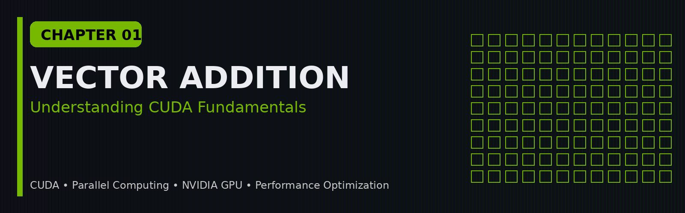
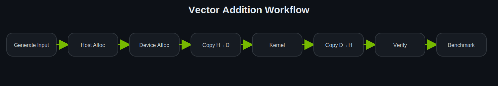
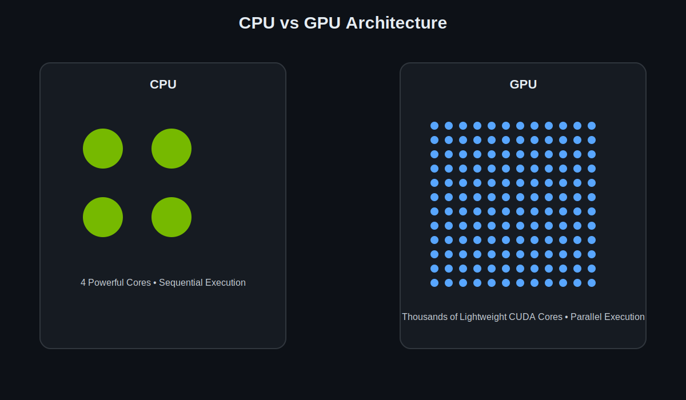
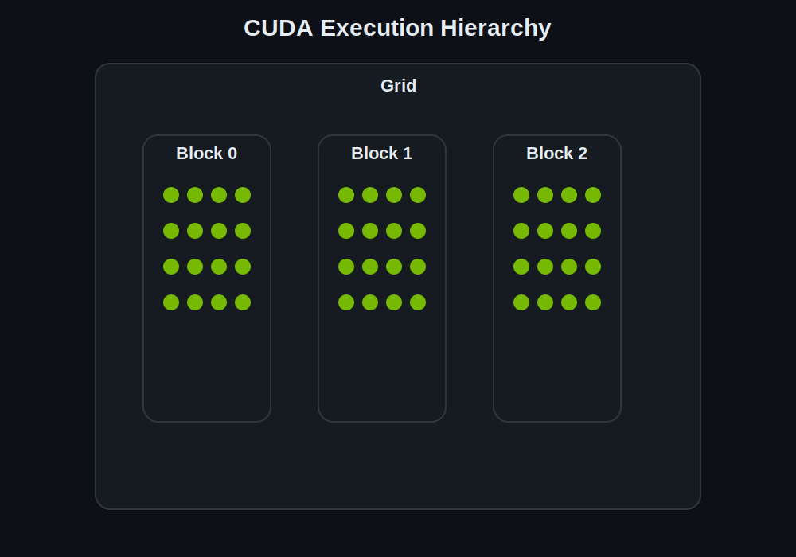
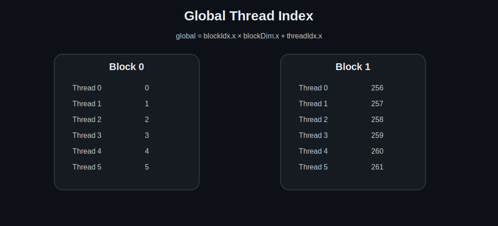
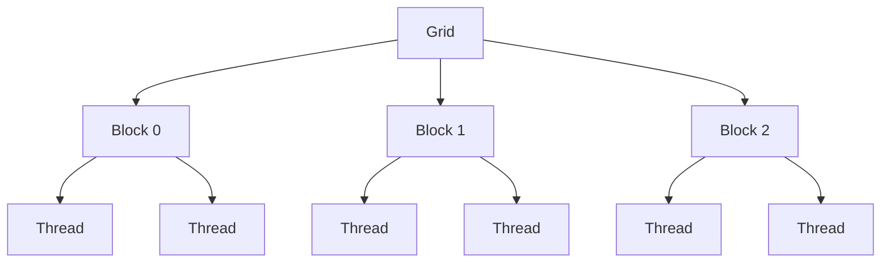
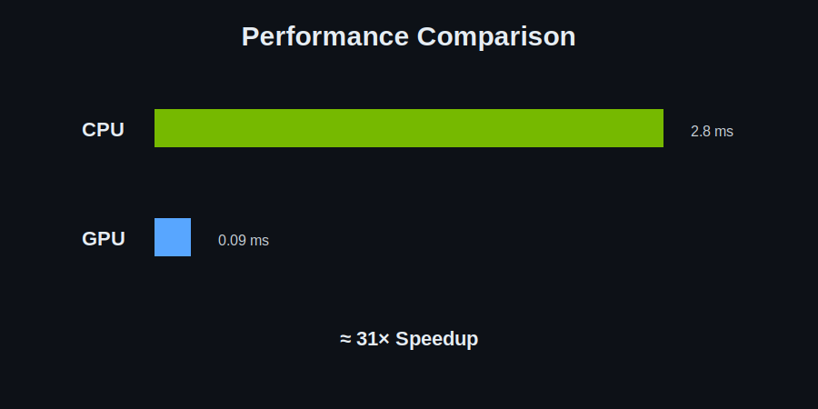

<!-- ========================================================== -->
<!-- Chapter 01 -->
<!-- ========================================================== -->

<p align="center">
  
</p>

<h1 align="center">
Chapter 01 — Vector Addition using CUDA C++
</h1>

<p align="center">
The "Hello World" of GPU Programming
</p>

<p align="center">


</p>

---

# Overview

Vector Addition is traditionally considered the **Hello World** program of CUDA programming.

Although the computation itself is mathematically simple, it introduces nearly every fundamental concept required to begin GPU programming:

- CUDA Kernels
- Thread Hierarchy
- Grid and Block Configuration
- Device Memory Allocation
- Memory Transfer
- Kernel Launch
- GPU Synchronization
- Performance Benchmarking

By the end of this chapter, you'll understand not only how to write your first CUDA program but also how the CPU and GPU cooperate during execution.

---

# Learning Objectives

After completing this chapter, you should be able to:

- Explain why GPUs excel at data-parallel workloads.
- Understand the CUDA execution model.
- Write and launch a CUDA kernel.
- Allocate memory on both the Host and Device.
- Transfer data between CPU and GPU.
- Configure blocks and grids.
- Benchmark CPU and GPU implementations.
- Verify the correctness of GPU results.

---

# Prerequisites

Before starting this chapter, you should know:

- Basic C++
- Arrays
- Loops
- Functions
- Pointers

No previous CUDA experience is assumed.

---

# Visual Overview

<p align="center">

</p>

The overall execution pipeline is:

```
Generate Input

↓

Allocate GPU Memory

↓

Copy Input to GPU

↓

Launch CUDA Kernel

↓

GPU Computes Result

↓

Copy Result Back

↓

Verify Output

↓

Benchmark Performance
```

---

# Problem Statement

Given two vectors

```
A = [a₀, a₁, a₂, ...]
```

and

```
B = [b₀, b₁, b₂, ...]
```

compute

```
C = A + B
```

where

```
C[i] = A[i] + B[i]
```

for every valid index.

Although simple, this problem is ideal for demonstrating **data parallelism** because each computation is completely independent of every other computation.

---

# Why Start with Vector Addition?

Every element in the output vector depends only on the corresponding elements of the two input vectors.

For example:

```
A = [1  2  3  4]

B = [5  6  7  8]

----------------

C = [6  8 10 12]
```

Notice that:

```
C[0]

does not depend on

C[1]
```

Similarly,

```
C[3]

does not depend on

C[2]
```

Since each calculation is independent, all additions can be performed simultaneously.

This makes vector addition one of the simplest examples of **embarrassingly parallel computation**, where the workload can be divided among thousands of GPU threads with almost no coordination.

---

# Why Use a GPU?

Imagine adding one million numbers.

A traditional sequential program performs the work one element at a time.

```
Element 0

↓

Element 1

↓

Element 2

↓

...

↓

Element 999999
```

A GPU takes a completely different approach.

Instead of assigning all the work to a single execution thread, it distributes the computation across thousands of lightweight threads that operate in parallel.

Conceptually:

```
Thread 0 → C[0]

Thread 1 → C[1]

Thread 2 → C[2]

...

Thread N → C[N]
```

Because each thread performs only one addition, the GPU can process very large vectors much faster than a sequential CPU implementation when the workload is sufficiently large.

---

# CPU vs GPU Execution

<p align="center">

</p>

The key difference is not the mathematical operation—the CPU and GPU both compute the same result.

The difference lies in **how the work is distributed**.

| CPU | GPU |
|------|------|
| Sequential execution | Parallel execution |
| Few powerful cores | Thousands of lightweight cores |
| Optimized for latency | Optimized for throughput |
| Best for complex logic | Best for repetitive computations |

Understanding this distinction is fundamental to GPU programming.

---

# The CUDA Programming Model

CUDA follows a hierarchical execution model that allows a large computation to be divided into many small, independent tasks.

Instead of executing one instruction after another like a traditional CPU program, CUDA launches **thousands of lightweight threads** that work together to solve the problem in parallel.

Understanding this hierarchy is the key to writing efficient CUDA programs.

The hierarchy consists of four levels:

```
GPU
    │
    ▼
Grid
    │
    ▼
Thread Blocks
    │
    ▼
Threads
```

Each level has a specific purpose, which we'll explore below.

---

# Grid

A **Grid** is the highest level of execution in CUDA.

When a kernel is launched, CUDA creates **one Grid**, which contains one or more **Thread Blocks**.

<p align="center">

</p>

Think of the Grid as the complete workforce assigned to solve a problem.

For a vector containing one million elements, the Grid may contain thousands of thread blocks working together.

---

# Thread Block

A **Thread Block** is a group of threads that execute on the same Streaming Multiprocessor (SM).

Threads within a block can:

- Cooperate with each other.
- Synchronize execution.
- Share fast on-chip memory (Shared Memory).

However, threads from different blocks cannot directly communicate.

<p align="center">

</p>

In this project we use:

```cpp
BLOCK_SIZE = 256;
```

which means every block contains **256 threads**.

---

# Thread

A **Thread** is the smallest execution unit in CUDA.

Each thread executes the same kernel code but operates on different data.

For vector addition, one thread computes exactly one element:

```text
Thread 0  →  C[0]

Thread 1  →  C[1]

Thread 2  →  C[2]

...

Thread N  →  C[N]
```

This design makes vector addition an excellent example of data-parallel programming.

---

# The Relationship Between Grid, Block, and Thread

The execution hierarchy can be visualized as:

```text
Grid
│
├── Block 0
│     ├── Thread 0
│     ├── Thread 1
│     ├── Thread 2
│     └── ...
│
├── Block 1
│     ├── Thread 0
│     ├── Thread 1
│     ├── Thread 2
│     └── ...
│
└── Block 2
      ├── Thread 0
      ├── Thread 1
      └── ...
```

Every thread executes the same kernel, but each thread receives a different index.

---

# CUDA Kernel

The computation performed by the GPU is defined inside a **Kernel**.

Unlike a normal C++ function, a CUDA kernel executes on the GPU.

```cpp
__global__ void vec_add_gpu(float* a,
                            float* b,
                            float* c,
                            int n)
{
    int i = blockIdx.x * blockDim.x + threadIdx.x;

    if(i < n)
    {
        c[i] = a[i] + b[i];
    }
}
```

The keyword

```cpp
__global__
```

tells the CUDA compiler that:

- The function executes on the GPU.
- The function is launched from the CPU.

Unlike ordinary C++ functions, a kernel is executed by **many GPU threads simultaneously**.

---

# Launching a Kernel

CUDA kernels are launched using a special syntax:

```cpp
vec_add_gpu<<<num_blocks, BLOCK_SIZE>>>(
    d_a,
    d_b,
    d_c,
    N
);
```

Unlike a normal function call,

```cpp
function(arguments);
```

CUDA introduces the execution configuration:

```cpp
<<<Grid, Block>>>
```

This tells CUDA:

- How many thread blocks to create.
- How many threads should exist inside each block.

The execution configuration determines how the workload is distributed across the GPU.

---

# Global Thread Index

Every thread needs to know which element it is responsible for processing.

CUDA provides three built-in variables:

| Variable | Meaning |
|----------|---------|
| `threadIdx.x` | Position of the thread inside its block |
| `blockIdx.x` | Position of the block inside the grid |
| `blockDim.x` | Number of threads per block |

The global index is calculated as:

```cpp
int i = blockIdx.x * blockDim.x + threadIdx.x;
```

This formula ensures that every thread receives a unique index.


For example, with:

```text
BLOCK_SIZE = 256
```

| Block | Thread | Global Index |
|-------|--------|--------------|
| 0 | 0 | 0 |
| 0 | 1 | 1 |
| 0 | 2 | 2 |
| ... | ... | ... |
| 1 | 0 | 256 |
| 1 | 1 | 257 |
| 1 | 2 | 258 |

Without this calculation, multiple threads would end up processing the same elements.

---

# Boundary Check

The kernel includes the following condition:

```cpp
if (i < n)
```

Why is this necessary?

The total number of launched threads is often slightly larger than the number of vector elements.

For example:

```text
Vector Size      = 1000

Threads per Block = 256

Required Blocks = 4

Total Threads = 1024
```

Only the first 1000 threads perform useful work.

The remaining 24 threads simply exit because the boundary check prevents them from accessing memory beyond the end of the array.

Without this condition, the program could attempt to read or write invalid memory, leading to undefined behavior.


---

# Complete Source Code

The complete implementation for this chapter is available in:

```text
01-Vector-Addition/vector_addition.cu
```

Instead of reading the entire program at once, we'll break it into smaller sections and understand the purpose of each part.

---

# Header Files

The program begins by including the required header files.

```cpp
#include <stdio.h>
#include <stdlib.h>
#include <cuda_runtime.h>
#include <time.h>
```

## Explanation

Each header provides a specific set of functionality required by the program.

| Header | Purpose |
|---------|---------|
| `stdio.h` | Input and output functions such as `printf()` |
| `stdlib.h` | Memory allocation and random number generation |
| `cuda_runtime.h` | CUDA Runtime API (`cudaMalloc`, `cudaMemcpy`, `cudaFree`, etc.) |
| `time.h` | High-resolution timing for benchmarking |

---

### Why do we need `cuda_runtime.h`?

Unlike standard C++, CUDA introduces many new functions that allow the CPU to interact with the GPU.

Examples include:

```cpp
cudaMalloc()

cudaMemcpy()

cudaFree()

cudaDeviceSynchronize()
```

Without including `cuda_runtime.h`, the compiler would not recognize these CUDA-specific APIs.

---

### Key Takeaway

Every CUDA program starts by including the CUDA Runtime library, which provides the functions needed to allocate memory, launch kernels, synchronize execution, and communicate with the GPU.

---

# Constants

The next section defines two constants.

```cpp
#define N 1000000
#define BLOCK_SIZE 256
```

---

## Number of Elements

```cpp
#define N 1000000
```

This specifies the size of the vectors used throughout the program.

Each vector contains **one million floating-point numbers**.

```
Vector A

↓

1,000,000 Elements

↓

Vector B

↓

1,000,000 Elements
```

Larger vectors provide enough work to demonstrate the benefits of GPU parallelism.

If the vectors were very small, the overhead of launching the GPU would outweigh its advantages.

---

## Block Size

```cpp
#define BLOCK_SIZE 256
```

This constant determines how many GPU threads belong to a single thread block.

For this project:

```
Block

↓

256 Threads
```

A block size of **256** is commonly used because it maps well to many NVIDIA GPU architectures and provides good hardware utilization.

> **Note:** There is no single "best" block size for every application. Choosing an appropriate block size is an important performance optimization topic that we'll revisit in later chapters.

---

### Key Takeaway

The constants define:

- The size of the problem.
- How the workload is divided among GPU threads.

---

# Initializing the Input Vectors

Before any computation begins, the program generates random input data.

```cpp
void init_vec(float* vec, int n)
{
    for(int i = 0; i < n; i++)
    {
        vec[i] = (float)rand() / RAND_MAX;
    }
}
```

---

## Explanation

This function fills the vector with random floating-point numbers between **0** and **1**.

Example:

```
0.14

0.82

0.37

0.91

...
```

Using random values makes the benchmark more representative than repeatedly using the same constant.

---

### Why not use fixed numbers?

The objective of this project is to measure computational performance rather than validate a specific mathematical example.

Random input provides a more realistic workload while still allowing us to verify the correctness of the results.

---

### Key Takeaway

Every benchmark should use realistic input data instead of trivial examples whenever possible.

---

# Measuring Execution Time

To compare CPU and GPU performance, the program measures execution time using a helper function.

```cpp
double get_time()
{
    struct timespec ts;

    clock_gettime(CLOCK_MONOTONIC, &ts);

    return ts.tv_sec + ts.tv_nsec * 1e-9;
}
```

---

## Explanation

The function returns the current time with nanosecond precision.

This allows us to calculate the execution time by recording:

```
Start Time

↓

Program Execution

↓

End Time

↓

Elapsed Time
```

---

### Why use `CLOCK_MONOTONIC`?

Unlike the system clock, a monotonic clock always moves forward.

It is unaffected by:

- Time-zone changes
- Manual clock adjustments
- Network time synchronization

This makes it more reliable for benchmarking.

---

### A Note on GPU Timing

For educational purposes, this project measures GPU execution using the same timer as the CPU.

However, professional CUDA applications typically use **CUDA Events** for more accurate kernel timing.

We'll introduce CUDA Events in a later chapter after building a solid understanding of the CUDA programming model.

---

### Key Takeaway

Accurate benchmarking is essential when comparing CPU and GPU implementations.

Choosing an appropriate timer helps ensure that the measured results are meaningful.

---

# CPU Implementation

Before introducing parallel execution, the program first implements the algorithm on the CPU.

```cpp
void vec_add_cpu(float* a,
                 float* b,
                 float* c,
                 int n)
{
    for(int i = 0; i < n; i++)
    {
        c[i] = a[i] + b[i];
    }
}
```

---

## Explanation

The CPU processes the vectors sequentially.

```
Read A[0]

↓

Read B[0]

↓

Compute

↓

Store C[0]

↓

Repeat
```

This process continues until every element has been processed.

---

### Why implement the CPU version first?

The CPU implementation serves two important purposes:

1. It provides a **reference implementation** for verifying the correctness of the GPU output.
2. It establishes a **performance baseline** that allows us to measure the speedup achieved by the GPU.

Without a CPU implementation, it would be difficult to determine whether the GPU results are correct or how much faster the GPU actually is.

---

### Time Complexity

For a vector containing **N** elements, the CPU performs **N additions**.

```
Time Complexity

↓

O(N)
```

Although modern CPUs contain multiple cores, this implementation executes sequentially using a single thread.

---

### Key Takeaway

Always establish a correct CPU implementation before optimizing with parallel programming.

---

---

# Host and Device Memory

One of the most important concepts in CUDA programming is understanding that the **CPU** and **GPU** have separate memory spaces.

Unlike a traditional C++ program, where the CPU operates directly on data stored in RAM, a CUDA program involves two processors working together:

- **CPU (Host)** – Responsible for controlling the program, allocating memory, launching kernels, and coordinating execution.
- **GPU (Device)** – Responsible for performing massively parallel computations.

Because these processors have separate memories, data must be explicitly transferred between them.

---

## Memory Architecture

The relationship between the CPU and GPU can be visualized as follows:


Unlike normal C++ programs, the GPU **cannot directly read variables stored in the CPU's RAM**.

Likewise, the CPU **cannot directly access GPU memory**.

Instead, CUDA provides memory transfer functions that move data between these two memory spaces.

---

# Host Memory Allocation

The program first allocates memory on the CPU.

```cpp
float *h_a;
float *h_b;
float *h_c_cpu;
float *h_c_gpu;

size_t size = N * sizeof(float);

h_a = (float*)malloc(size);
h_b = (float*)malloc(size);
h_c_cpu = (float*)malloc(size);
h_c_gpu = (float*)malloc(size);
```

---

## Why use `malloc()`?

`malloc()` allocates memory in the computer's **main memory (RAM)**.

These arrays are used for:

| Variable | Purpose |
|----------|---------|
| `h_a` | Input Vector A |
| `h_b` | Input Vector B |
| `h_c_cpu` | Output computed by the CPU |
| `h_c_gpu` | Output copied back from the GPU |

The prefix **`h_`** stands for **Host**.

This naming convention is widely used in CUDA programs because it immediately tells the reader that these variables reside in CPU memory.

---

## Memory Size Calculation

```cpp
size_t size = N * sizeof(float);
```

Instead of writing

```cpp
4000000
```

we calculate the required memory dynamically.

For this project:

```
Number of Elements = 1,000,000

Size of float = 4 Bytes
```

Therefore,

```
1,000,000 × 4

=

4,000,000 Bytes

≈ 4 MB
```

Each vector occupies approximately **4 MB**.

Since four vectors are allocated on the CPU, the total host memory usage is roughly **16 MB**.

---

### Key Takeaway

Host memory is simply the computer's RAM.

The CPU reads from it and writes to it directly.

The GPU, however, cannot use this memory until the data has been copied to device memory.

---

# Device Memory Allocation

Next, the program allocates memory on the GPU.

```cpp
float *d_a;
float *d_b;
float *d_c;

cudaMalloc(&d_a, size);
cudaMalloc(&d_b, size);
cudaMalloc(&d_c, size);
```

---

## What is `cudaMalloc()`?

`cudaMalloc()` allocates memory inside the GPU's **Global Memory (VRAM)**.

Unlike `malloc()`, which allocates memory in RAM, `cudaMalloc()` reserves memory on the graphics card.

The prefix **`d_`** stands for **Device**.

| Variable | Purpose |
|----------|---------|
| `d_a` | GPU copy of Vector A |
| `d_b` | GPU copy of Vector B |
| `d_c` | GPU output vector |

---

## Why not use `malloc()` for the GPU?

A common beginner question is:

> *"Why can't I simply use `malloc()`?"*

The answer is that the CPU and GPU have different physical memories.

```text
CPU RAM
───────────────

malloc()

↓

Host Arrays


GPU VRAM
───────────────

cudaMalloc()

↓

Device Arrays
```

Since these memories are separate, CUDA must allocate memory independently on the GPU.

---

### Key Takeaway

- `malloc()` → Host Memory
- `cudaMalloc()` → Device Memory

---

# Copying Data to the GPU

At this stage,

the input vectors exist only in Host Memory.

Before the GPU can process them, they must be copied to Device Memory.

```cpp
cudaMemcpy(
    d_a,
    h_a,
    size,
    cudaMemcpyHostToDevice
);

cudaMemcpy(
    d_b,
    h_b,
    size,
    cudaMemcpyHostToDevice
);
```

---

## Understanding `cudaMemcpy()`

The general syntax is:

```cpp
cudaMemcpy(
    destination,
    source,
    size,
    direction
);
```

Each parameter has a specific meaning.

| Parameter | Description |
|-----------|-------------|
| Destination | Where the data should be copied to |
| Source | Where the data currently exists |
| Size | Number of bytes to copy |
| Direction | Direction of the memory transfer |

---

### Transfer Directions

CUDA supports several types of memory transfers.

| Direction | Meaning |
|-----------|---------|
| `cudaMemcpyHostToDevice` | CPU → GPU |
| `cudaMemcpyDeviceToHost` | GPU → CPU |
| `cudaMemcpyDeviceToDevice` | GPU → GPU |
| `cudaMemcpyHostToHost` | CPU → CPU |

For this project, we first transfer the input vectors from the CPU to the GPU.

---

### Visualizing the Transfer


After these transfers complete, the GPU has everything it needs to perform the computation.

---

# Why is Data Transfer Necessary?

Imagine asking a chef to cook a meal, but never giving them the ingredients.

The chef has the skills—but not the ingredients.

The GPU is similar.

The GPU knows **how** to perform vector addition, but until the input vectors are copied into its own memory, it has nothing to work on.

Data transfer provides the GPU with the information it needs to begin computation.

---

# Key Takeaways

At this point in the program:

- Memory has been allocated on both the CPU and GPU.
- Input vectors have been generated on the CPU.
- Input vectors have been copied to the GPU.
- The GPU is now ready to execute the CUDA kernel.

The next step is launching the kernel and allowing thousands of GPU threads to perform the computation in parallel.


---

# Determining the Number of Blocks

Before launching the CUDA kernel, we need to decide **how many thread blocks** are required to process all elements of the input vectors.

The program calculates this using:

```cpp
int num_blocks = (N + BLOCK_SIZE - 1) / BLOCK_SIZE;
```

---

## Why is this calculation necessary?

Each thread processes **exactly one element**.

Since each block contains a fixed number of threads (`BLOCK_SIZE = 256`), we must determine how many blocks are needed to cover the entire vector.

For example:

```text
Number of Elements = 1000

Threads per Block = 256
```

Dividing:

```text
1000 / 256 = 3.90
```

Since we cannot launch a fraction of a block, CUDA launches **4 blocks**.

```
4 Blocks × 256 Threads = 1024 Threads
```

The extra threads simply perform no work because of the boundary check:

```cpp
if (i < n)
```

This approach guarantees that every element receives a thread without requiring `N` to be an exact multiple of the block size.

---

# Launching the CUDA Kernel

Once the execution configuration has been determined, the kernel can be launched.

```cpp
vec_add_gpu<<<num_blocks, BLOCK_SIZE>>>(
    d_a,
    d_b,
    d_c,
    N
);
```

Unlike a normal C++ function call, CUDA kernels include an **execution configuration** enclosed within triple angle brackets.

```cpp
<<<Grid, Block>>>
```

where:

- **Grid** → Number of thread blocks.
- **Block** → Number of threads inside each block.

The complete execution hierarchy is:



When the kernel is launched, every thread begins executing the same kernel function simultaneously.

---

# GPU Synchronization

Kernel launches are **asynchronous**.

This means that after launching a kernel, the CPU does **not** wait for the GPU to finish.

Instead, it immediately continues executing the next instruction.

To ensure the GPU has completed its work, the program calls:

```cpp
cudaDeviceSynchronize();
```

This function blocks the CPU until every GPU thread has finished executing.

Without synchronization:

- Benchmark timings would be incorrect.
- Results might be copied before the GPU has finished writing them.
- Output could be incomplete or invalid.

---

# Warm-up Runs

Before measuring performance, the program performs several warm-up iterations.

```cpp
for(int i = 0; i < 4; i++)
{
    vec_add_cpu(...);

    vec_add_gpu<<<...>>>();

    cudaDeviceSynchronize();
}
```

---

## Why warm up the GPU?

The first kernel launch often includes one-time overhead such as:

- Driver initialization
- CUDA context creation
- Memory setup
- Internal caching

These initialization costs do not represent the steady-state performance of the program.

Warm-up runs ensure that the benchmark measures the computation itself rather than startup overhead.

---

# Benchmarking

Rather than timing the implementations once, the program executes them repeatedly and computes the average execution time.

Conceptually:

```text
CPU

Run 1
Run 2
Run 3
...
Run 20

↓

Average Time
```

The GPU follows the same procedure.

Averaging multiple runs reduces the effect of:

- Background operating system activity
- Temporary scheduling delays
- Clock frequency fluctuations

This produces more stable and meaningful benchmark results.

---

# Copying the Result Back

After the kernel finishes executing, the output vector still resides in **Device Memory**.

To access the results on the CPU, the data must be copied back.

```cpp
cudaMemcpy(
    h_c_gpu,
    d_c,
    size,
    cudaMemcpyDeviceToHost
);
```

The direction parameter

```cpp
cudaMemcpyDeviceToHost
```

indicates that data is being transferred from GPU memory back to CPU memory.

At this point, both the CPU and GPU results are available for comparison.

---

# Verifying Correctness

Performance is important, but correctness is essential.

The program verifies that the GPU produces the same output as the CPU.

```cpp
fabs(h_c_cpu[i] - h_c_gpu[i]) < 1e-5
```

Because floating-point arithmetic may introduce tiny rounding differences, the comparison uses a small tolerance rather than checking for exact equality.

> **Note:** If your implementation currently compares:
>
> ```cpp
> fabs(h_c_gpu[i] - h_c_gpu[i])
> ```
>
> it is comparing the GPU output with itself.
>
> The correct comparison is:
>
> ```cpp
> fabs(h_c_cpu[i] - h_c_gpu[i])
> ```

---

# Memory Cleanup

Every allocation made during the program should be released once it is no longer needed.

Host memory:

```cpp
free(h_a);
free(h_b);
free(h_c_cpu);
free(h_c_gpu);
```

Device memory:

```cpp
cudaFree(d_a);
cudaFree(d_b);
cudaFree(d_c);
```

Releasing memory prevents memory leaks and is considered good programming practice.

---

# Expected Output

A typical execution might produce output similar to:

```text
Performing warmup runs...

Benchmarking CPU implementation...

Benchmarking GPU implementation...

CPU average time : 2.81 ms

GPU average time : 0.09 ms

Speedup : 31.2x

Results are correct.
```

> **Note:** Exact timings will vary depending on your GPU, CPU, compiler optimizations, and system workload.

<p align="center">

</p>

---

# Common Beginner Mistakes

If your program does not behave as expected, check the following:

### Forgetting the boundary check

```cpp
if (i < n)
```

Without this condition, extra threads may access memory beyond the array bounds.

---

### Forgetting `cudaDeviceSynchronize()`

Kernel launches are asynchronous.

If the CPU continues before the GPU finishes, timings and results may be incorrect.

---

### Using `malloc()` instead of `cudaMalloc()`

Remember:

- `malloc()` allocates memory in **Host Memory**.
- `cudaMalloc()` allocates memory in **Device Memory**.

---

### Forgetting to copy results back

Always copy the output vector from the GPU to the CPU before attempting to access or verify it.

---

# Summary

In this chapter, we implemented one of the simplest yet most important CUDA programs.

Along the way, we learned how to:

- Allocate Host and Device memory
- Transfer data between the CPU and GPU
- Write and launch a CUDA kernel
- Organize work using grids, blocks, and threads
- Synchronize GPU execution
- Benchmark CPU and GPU performance
- Verify computational correctness
- Properly release allocated resources

Although vector addition is a simple problem, it introduces nearly every fundamental concept needed to begin GPU programming.

These concepts will serve as the foundation for more advanced topics in the upcoming chapters.

---