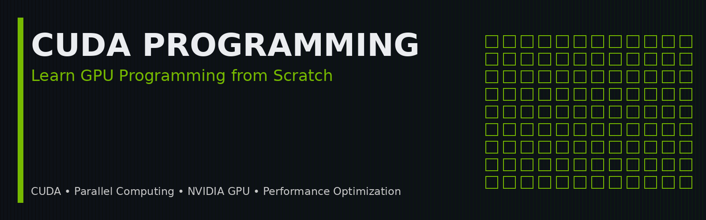

<!-- ========================================================== -->
<!-- CUDA Programming Repository -->
<!-- ========================================================== -->

<p align="center">
  
</p>

<h1 align="center">
CUDA Programming
</h1>

<p align="center">
A project-based guide to learning GPU Programming using CUDA C++, from fundamentals to advanced concepts.
</p>

<p align="center">


</p>

---

# Introduction

Welcome to my CUDA Programming repository.

This repository documents my journey of learning **GPU Programming using CUDA C++**, beginning with the fundamentals and gradually progressing toward advanced concepts used in:

- Artificial Intelligence
- High Performance Computing (HPC)
- Scientific Computing
- Computer Vision
- Robotics
- Deep Learning
- Parallel Computing

Unlike repositories that only provide source code, every project here is accompanied by detailed explanations, diagrams, code walkthroughs, and performance analysis so that readers can understand not only **how** CUDA works, but also **why** it works that way.

The long-term goal is to build a beginner-friendly reference that anyone can follow to learn CUDA programming from scratch.

---

# Why This Repository?

When I started learning CUDA, I noticed that most resources fell into one of two categories:

- They focused heavily on theory but provided little practical implementation.
- They provided code without explaining the underlying concepts.

I wanted a resource that combined both.

This repository is my attempt to bridge that gap by documenting every project with clear explanations, visual diagrams, annotated code, and practical examples.

As I continue learning, this repository will grow into a comprehensive collection of CUDA programming projects and notes.

---

# What You'll Learn

This repository is designed to take you from the basics of CUDA programming to more advanced GPU optimization techniques.

Topics include:

- GPU Architecture
- CUDA Programming Model
- Thread Hierarchy
- Memory Management
- Global Memory
- Shared Memory
- Constant Memory
- Unified Memory
- CUDA Streams
- CUDA Events
- Parallel Algorithms
- Matrix Operations
- Performance Benchmarking
- Profiling & Optimization
- CUDA Libraries
- Multi-GPU Programming

---

# Learning Roadmap

```text
CUDA Fundamentals
        │
        ▼
Memory Management
        │
        ▼
Parallel Algorithms
        │
        ▼
Performance Optimization
        │
        ▼
CUDA Libraries
        │
        ▼
Advanced CUDA Programming
```

---

# Repository Progress

| Chapter | Topic | Status |
|----------|-------|--------|
| 01 | Vector Addition | ✅ Completed |
| 02 | Matrix Addition | ⏳ Planned |
| 03 | Matrix Multiplication | ⏳ Planned |
| 04 | Shared Memory | ⏳ Planned |
| 05 | Parallel Reduction | ⏳ Planned |
| 06 | CUDA Streams | ⏳ Planned |
| 07 | CUDA Events | ⏳ Planned |
| 08 | Memory Coalescing | ⏳ Planned |
| 09 | Prefix Sum | ⏳ Planned |
| 10 | Image Processing | ⏳ Planned |

---

# Repository Structure

```text
CUDA-Programming/

│
├── README.md
├── LICENSE
├── .gitignore
│
├── assets/
│     ├── banner.png
│     ├── cpu-vs-gpu.png
│     ├── thread-hierarchy.png
│     └── memory-flow.png
│
├── 01-Vector-Addition/
│      ├── README.md
│      └── vector_addition.cu
│
├── 02-Matrix-Addition/
│
├── 03-Matrix-Multiplication/
│
└── ...
```

---

# Project Index

| Chapter | Description |
|----------|-------------|
| [Vector_Addition](Vector_Addition/readme.md) | Learn the fundamentals of CUDA kernels, thread indexing, and memory transfer. |

---
# Learning Approach

This repository follows a simple principle:

> **Every project should teach one major CUDA concept well.**

Instead of building large applications immediately, each chapter focuses on understanding a specific idea thoroughly before moving to the next topic.

This incremental approach makes learning CUDA much more approachable and helps build a strong foundation for advanced GPU programming.

---

# Technologies Used

This repository primarily uses the following technologies:

| Technology | Purpose |
|------------|---------|
| **CUDA** | GPU Programming Platform |
| **C++17** | Core Programming Language |
| **NVCC** | CUDA Compiler |
| **Git** | Version Control |
| **GitHub** | Repository Hosting |
| **Markdown** | Documentation |
| **Google Colab** | Cloud GPU Environment (Optional) |

---

# Prerequisites

To follow along with the projects in this repository, you should be comfortable with:

- Basic C++
- Functions
- Arrays
- Pointers
- Loops
- Basic command-line usage

No prior CUDA knowledge is required.

Each chapter introduces new concepts gradually.

---

# Getting Started

## 1. Clone the Repository

```bash
git clone https://github.com/ARVINCENZO/CUDA_Programming.git
```

---

## 2. Navigate to the Repository

```bash
cd CUDA_Programming
```

---

## 3. Compile a CUDA Program

Example:

```bash
cd Vector_Addition

nvcc vector_addition.cu -o vector_addition
```

---

## 4. Run the Program

Linux / macOS

```bash
./vector_addition
```

Windows

```bash
vector_addition.exe
```

---

# Learning Strategy

This repository is intentionally structured like a book.

Each chapter introduces exactly one new CUDA concept while reinforcing concepts learned previously.

For every project, you'll find:

- Concept explanation
- Visual diagrams
- Annotated source code
- API explanations
- Benchmark results
- Common mistakes
- Key takeaways

This allows each chapter to be studied independently while still contributing to a broader understanding of CUDA programming.

---

# Repository Goals

The long-term objectives of this repository are to:

- Build a strong foundation in CUDA programming
- Understand GPU architecture and parallel execution
- Learn performance optimization techniques
- Explore CUDA libraries
- Develop production-quality CUDA code
- Create a beginner-friendly learning resource

---

# Recommended Resources

If you'd like to explore CUDA further, these are excellent references:

## Official Documentation

- NVIDIA CUDA Programming Guide
- NVIDIA CUDA Best Practices Guide
- NVIDIA CUDA Samples

## Books

- *Programming Massively Parallel Processors*
- *Professional CUDA C Programming*

## YouTube

- NVIDIA Developer
- FreeCodeCamp
- CoffeeBeforeArch
- HPC Tutorials

---

# How to Use This Repository

If you're new to CUDA, I recommend following the projects in order.

```
Chapter 01

↓

Chapter 02

↓

Chapter 03

↓

...
```

Each chapter builds on the previous one.

Skipping ahead may make some concepts difficult to understand.

---

# Future Topics

Some topics planned for future chapters include:

- Matrix Multiplication
- Shared Memory
- Constant Memory
- Unified Memory
- CUDA Streams
- CUDA Events
- Parallel Reduction
- Prefix Sum (Scan)
- Histograms
- Image Processing
- Convolution
- Warp-Level Programming
- Tensor Cores
- Multi-GPU Programming
- CUDA Graphs
- cuBLAS
- cuDNN

---

# Contributing

Although this repository is primarily a personal learning project, suggestions and improvements are always welcome.

If you notice an error or have ideas to improve the explanations, feel free to open an issue or submit a pull request.

---

# License

This project is licensed under the MIT License.

See the [LICENSE](LICENSE) file for details.

---

# Connect

If this repository helps you learn CUDA, feel free to:

- ⭐ Star the repository
- 🍴 Fork it
- 📢 Share it with others
- 💬 Open discussions or issues

Learning is better when shared with the community.

---

<p align="center">

Made with ❤️ while learning CUDA Programming.

</p>